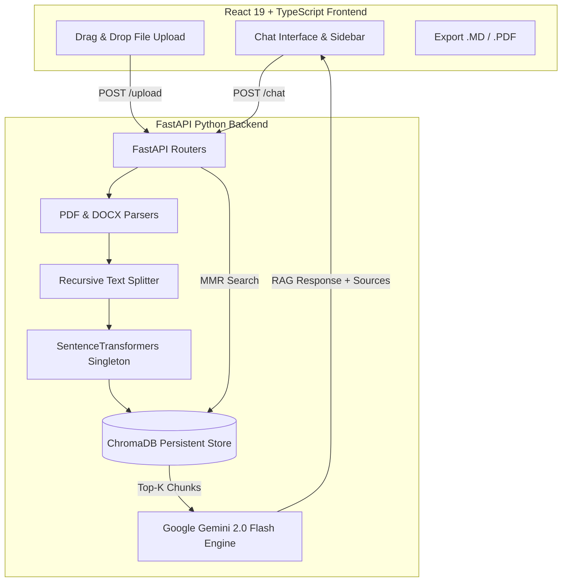

# AI-Assisted RAG Document Reader (React + FastAPI + ChromaDB + Gemini)

A production-ready, high-performance RAG (Retrieval-Augmented Generation) document reader web application built with a modern **React 19 + TypeScript** frontend and a **Python FastAPI** backend powered by **ChromaDB**, **SentenceTransformers**, **LangChain**, and **Google Gemini 2.0 Flash**.

---

## 🌟 Features

- **ChatGPT-Style Modern UI**: Glassmorphism design, dark/light themes, sleek animations (Framer Motion), and responsive layout.
- **Multi-Format Document Ingestion**: Upload PDF (`.pdf`) and Microsoft Word (`.docx`) files with drag-and-drop support and batch processing progress.
- **Persistent Vector Store (ChromaDB)**: Replaces legacy FAISS with persistent local storage in `backend/chroma_db/` supporting HNSW similarity search and metadata tracking.
- **Optimized Text Chunking**: Powered by LangChain's `RecursiveCharacterTextSplitter` (`chunk_size=800`, `chunk_overlap=150`) to preserve paragraph boundaries.
- **Advanced Retrieval**:
  - Cosine similarity + **Maximum Marginal Relevance (MMR)** search for diverse context retrieval.
  - Chunk deduplication and relevance score thresholding.
  - Context reranking prior to LLM answer generation.
- **Google Gemini 2.0 Flash Integration**: RAG answer generation with citation attribution and fallback error handling.
- **Rich Chat Features**:
  - Markdown rendering with code syntax highlighting and table formatting.
  - Source chunk inspector modal displaying similarity scores (%) and text previews.
  - Copy response to clipboard.
  - Export chat history to **Markdown (.md)** or **PDF (.pdf)**.
  - Quick suggested question prompt pills.
- **Live System Metrics**: Monitor vector store size (MB), total chunk counts, document listings, search latency, and LLM timing metrics.

---

## 🏗️ Architecture



---

## 📁 Directory Structure

```text
Ai-doc-reader/
├── backend/                  # FastAPI Application
│   ├── app/
│   │   ├── main.py           # FastAPI entrypoint & startup lifespan
│   │   ├── config.py         # App configuration & .env loader
│   │   ├── routers/
│   │   │   ├── health.py     # GET /health & GET /stats
│   │   │   ├── documents.py  # GET /documents & DELETE /documents
│   │   │   ├── upload.py     # POST /upload
│   │   │   └── chat.py       # POST /chat
│   │   ├── services/
│   │   │   ├── embedding_service.py # Singleton sentence-transformers loader
│   │   │   ├── chroma_service.py    # ChromaDB persistent vector manager
│   │   │   ├── doc_parser.py        # PDF & DOCX text extractors
│   │   │   ├── chunker.py           # Recursive text chunker
│   │   │   └── llm_service.py       # Gemini 2.0 Flash RAG engine
│   │   └── models/
│   │       └── schemas.py    # Pydantic data schemas
│   ├── chroma_db/            # Persistent ChromaDB storage
│   ├── requirements.txt      # Python dependencies
│   └── .env                  # API keys & configuration
│
└── frontend/                 # React 19 + Vite Application
    ├── src/
    │   ├── components/
    │   │   ├── layout/       # Sidebar & Top Bar
    │   │   ├── chat/         # MessageItem, ChatInput, SourcesModal
    │   │   ├── upload/       # FileDropzone
    │   │   └── stats/        # DocumentStatsModal
    │   ├── services/         # Axios API client
    │   ├── contexts/         # ThemeContext (Dark/Light mode)
    │   ├── types/            # TypeScript interfaces
    │   └── utils/            # Export utilities (.md & .pdf)
    ├── package.json
    ├── vite.config.ts
    └── tailwind.config.js
```

---

## 🚀 Getting Started

### Prerequisites

- **Python**: 3.10+
- **Node.js**: 18+ and `npm`

---

### 1. Backend Setup (FastAPI)

Navigate to the `backend/` directory:

```bash
cd backend
```

Install Python dependencies:

```bash
pip install -r requirements.txt
```

Create a `.env` file inside `backend/` (or update existing):

```env
GEMINI_API_KEY=your_google_gemini_api_key_here
GEMINI_MODEL=gemini-2.0-flash
EMBEDDING_MODEL_NAME=sentence-transformers/all-MiniLM-L6-v2
CHROMA_DB_DIR=backend/chroma_db
```

Start the FastAPI backend server:

```bash
python -m uvicorn app.main:app --reload --port 8000
```

The API will be live at `http://localhost:8000` (Interactive API docs at `http://localhost:8000/docs`).

---

### 2. Frontend Setup (React + Vite)

Navigate to the `frontend/` directory:

```bash
cd frontend
```

Install Node.js dependencies:

```bash
npm install --legacy-peer-deps
```

Start the Vite development server:

```bash
npm run dev
```

Open `http://localhost:5173` in your web browser.

---

## 🔌 API Reference

| Endpoint | Method | Description |
| :--- | :--- | :--- |
| `/health` | `GET` | Server health check and model loading status |
| `/stats` | `GET` | System metrics, document counts, and DB size (MB) |
| `/upload` | `POST` | Ingest multiple PDF/DOCX files into ChromaDB |
| `/chat` | `POST` | Ask context-aware questions and retrieve RAG answer + sources |
| `/documents` | `GET` | List all indexed document names and metadata |
| `/documents` | `DELETE` | Purge all indexed documents from ChromaDB |

---

## ⚙️ Key Configuration Options

- `GEMINI_API_KEY`: Google Gemini API Key (Required for AI answer generation).
- `EMBEDDING_MODEL_NAME`: HuggingFace embedding model (Default: `sentence-transformers/all-MiniLM-L6-v2`).
- `CHUNK_SIZE` & `CHUNK_OVERLAP`: Text chunking parameters (Default: 800 characters / 150 overlap).
