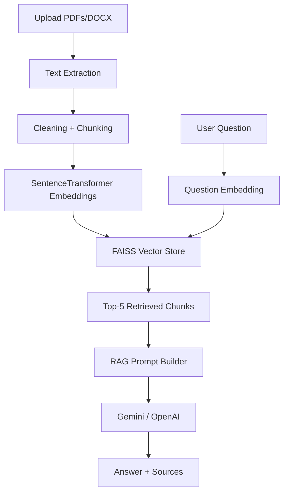

# AI-Assisted RAG-Based Document Reader

An end-to-end Streamlit application for uploading documents, indexing their content locally with FAISS, and asking natural-language questions with RAG-powered answers.

## Project Overview

This app lets users upload PDF and DOCX files, extracts their text, splits the content into overlapping chunks, creates embeddings with `all-MiniLM-L6-v2`, stores them in a local FAISS vector database, and uses Gemini to generate context-aware answers.

## Features

- Streamlit chatbot UI for document Q&A
- Multi-file upload support for PDF and DOCX files
- Text extraction with PyPDF2 and python-docx
- Text cleaning and overlapping chunking
- SentenceTransformer embeddings with `all-MiniLM-L6-v2`
- Local FAISS vector storage with save/load support
- Top-5 retrieval using cosine similarity
- Gemini-powered RAG responses
- Chat history and clear-chat support
- Loading spinner during answer generation
- Validation for invalid files, empty documents, missing API keys, and oversized uploads

## Architecture



## Installation

1. Create and activate a Python virtual environment.
2. Install dependencies:

```bash
pip install -r requirements.txt
```

3. Create a `.env` file in the project folder with your Gemini key:

```bash
GEMINI_API_KEY=your_key_here
GEMINI_MODEL=gemini-2.0-flash
```

If you prefer, copy the provided `.env.example` file to `.env` and fill in the key.

## Usage

Run the app:

```bash
streamlit run app.py
```

Then:

1. Upload one or more PDF or DOCX files.
2. Click Process documents.
3. Ask a question in the chat input.
4. Review the generated answer and the retrieved sources.

## Screenshots

Add application screenshots here after running the app locally.

## Future Improvements

- Add OCR support for scanned PDFs
- Add document-level citations with exact page references
- Add streaming token-by-token responses
- Add per-document filters and reindex controls
- Add richer source highlighting in the UI

## Local Persistence

The FAISS index and chunk metadata are saved in `data/vector_store/` so the app can be restarted without losing the indexed corpus.

## Configuration

- `GEMINI_API_KEY`: required, loaded from `.env`
- `GEMINI_MODEL`: optional, defaults to `gemini-2.0-flash` and automatically falls back to an available Gemini model if needed
